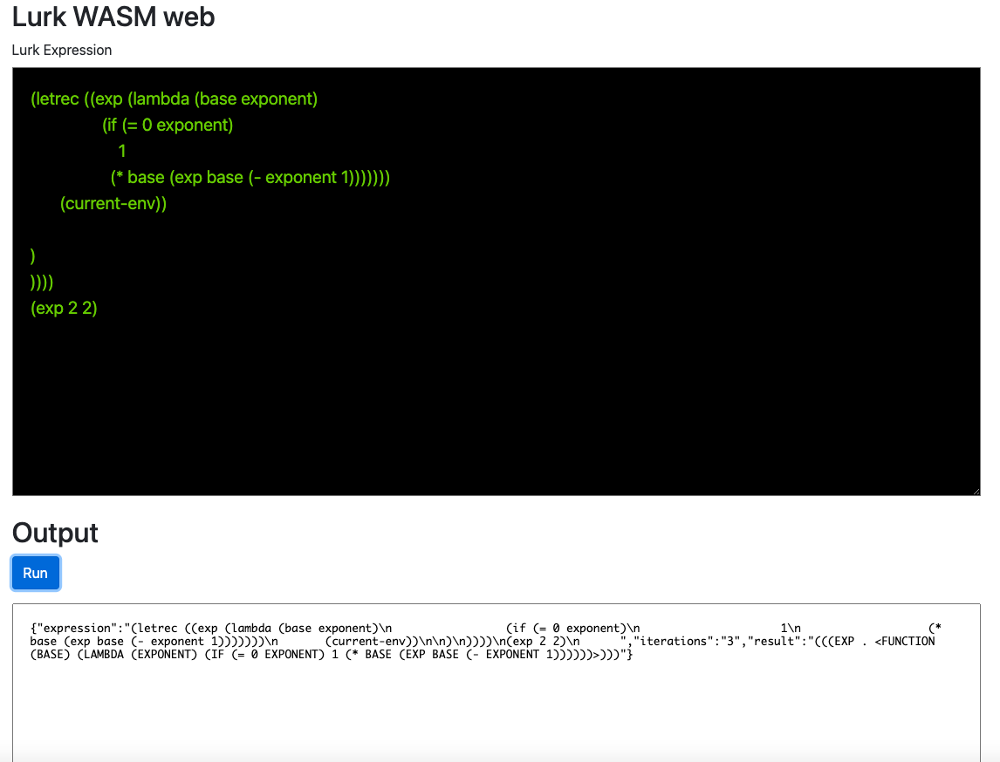

# Example Lurk in browser with wasm

## Pre-requisites
- [yarn](https://classic.yarnpkg.com/lang/en/docs/install/#mac-stable) or [npm](https://nodejs.org/en/download/package-manager/)
- [webpack](https://webpack.js.org/guides/installation/)
- [wasm-pack](https://rustwasm.github.io/wasm-pack/installer/)

## Install webpack using `yarn` and `npm`
```
# Using yarn
yarn add -D webpack-cli 

# Using npm
npm install --save-dev webpack
```

## Build and Run
```
yarn install
yarn start
```

## Test
Go to [localhost:8080](http://localhost:8080) to view the evaluator



## Live Demo (temp)
[wasm-eval](http://68.183.199.240:8081/)
